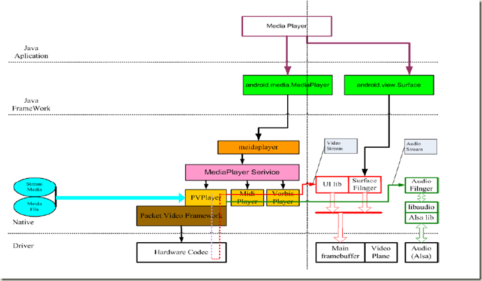
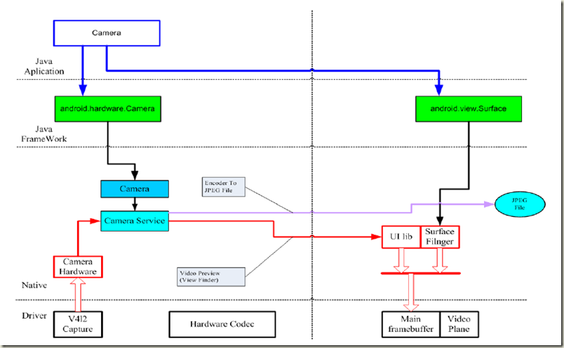
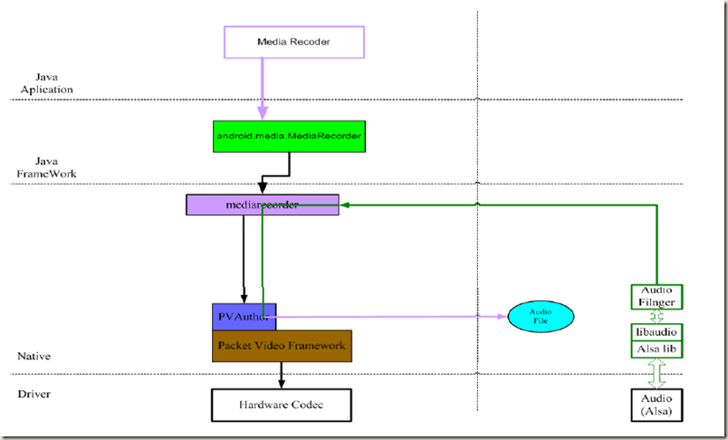
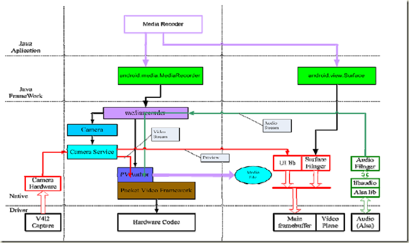
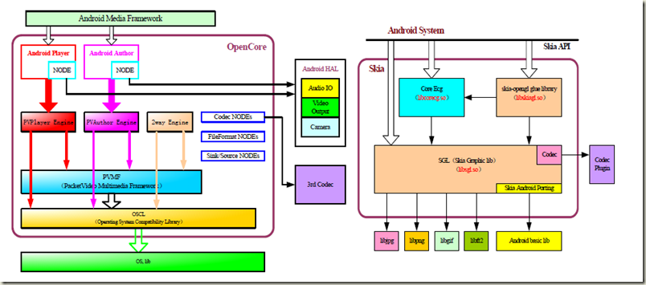
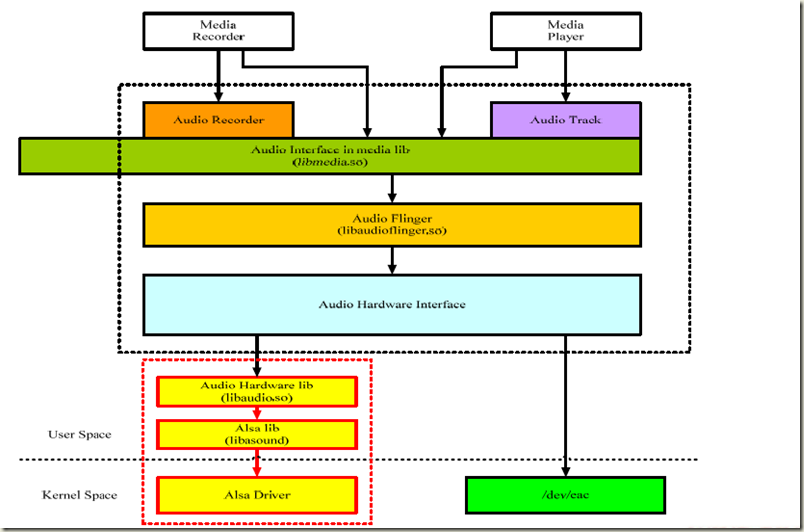
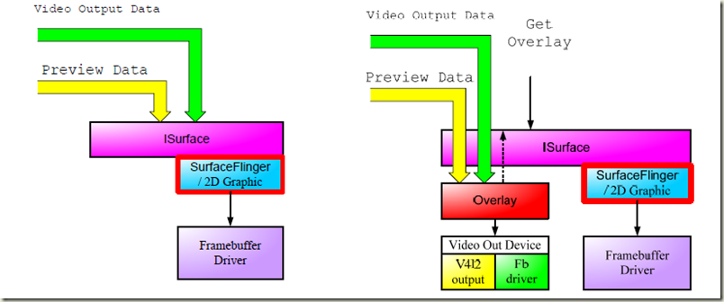
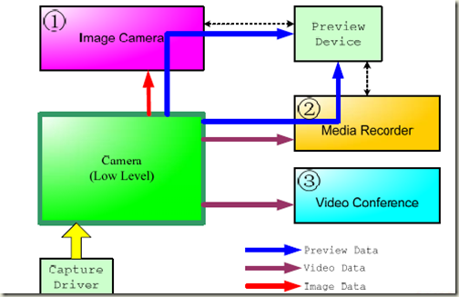
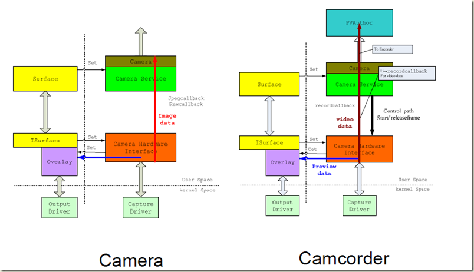
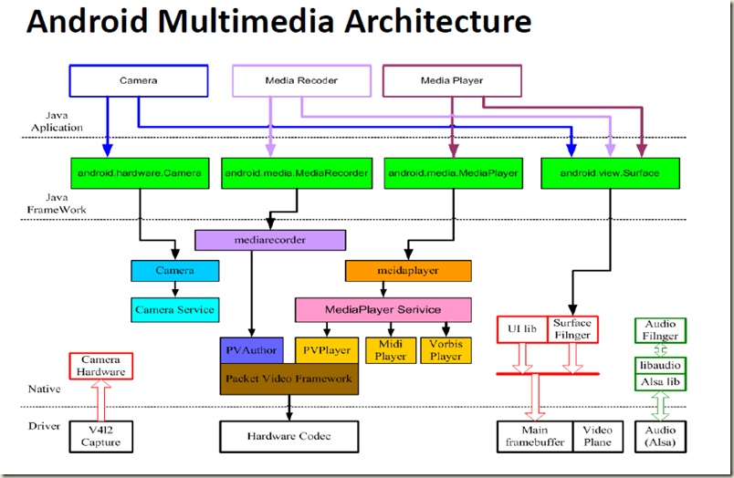

# Android 多媒体整体架构图

 

**MediaPlayer框架图**

 

**Camera框架图**

 

**SoundRecorder框架图**

 

**VideoCamera框架图**

 

**OpenCore与Skia**

 

**ALSA Audio框架图**

 

**Video Overlay框架图**

 

**Camera HAL演化图**

 

**MediaPlayer框架图**

 

**Camera框架图**

 

**SoundRecorder框架图**

 

**VideoCamera框架图**

 

**OpenCore与Skia**

 

**ALSA Audio框架图**

 

**Video Overlay框架图**

 

**Camera HAL演化图**

